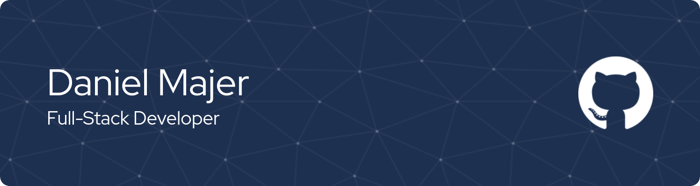

<!---  --->
<h1 align="center">Hi 👋, I'm Daniel</h1>
<h3 align="center">A passionate Frontend Developer from Slovakia 🇸🇰</h3>

  
  
  
  

 

<!--- Web illustrations by Storyset ( https://storyset.com/web ) --->

  
- 📫 How to reach me: <a href="mailto:dano.majer@protonmail.com">**dano.majer@protonmail.com**</a>

 
 
 

## ⚒️ Tools and technologies I'm working with

 

## 🏆 Goals
- 🚀 Gain experience in developing full-stack applications using **MERN stack** (MongoDB, Express, React, Node).
- 🌐 Improve my knowledge of **web accessibility standards** and incorporate them into my projects.
- 🔎 Expand my horizons. Learn new technologies & languages I haven't used before such as: **Vue, C++, Python etc.**

 

## 📈 Codewars stats

<!--  -->

## 📊 Github Stats

  
  
  

<!--
**dnomjr/dnomjr** is a ✨ _special_ ✨ repository because its `README.md` (this file) appears on your GitHub profile.

Here are some ideas to get you started:

- 🔭 I’m currently working on ...
- 🌱 I’m currently learning ...
- 👯 I’m looking to collaborate on ...
- 🤔 I’m looking for help with ...
- 💬 Ask me about ...
- 📫 How to reach me: ...
- 😄 Pronouns: ...
- ⚡ Fun fact: ...
-->
